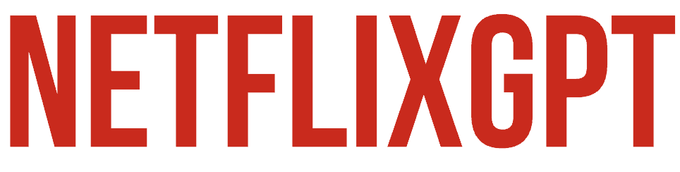

## Welcome to Netflix-GPT👍
NetflixGPT is a web application that leverages the power of OpenAI's GPT-3 to enhance your Netflix experience. With this project, you can generate personalized movie and TV show recommendations based on your preferences, engage in natural language conversations to discover new content, and get detailed information about your favorite shows and movies.

# Technologies Used
### NetflixGPT is built using a combination of modern web technologies and services:
- React: NetflixGPT is primarily built using React, a popular JavaScript library for building user interfaces.

- Tailwind CSS: We have used Tailwind CSS for efficient and responsive styling, ensuring a seamless user experience across devices.

- Redux Toolkit: Redux Toolkit helps manage the application's state, making it easier to handle complex data flows and state changes.

- Firebase: Firebase is used for user authentication, ensuring secure access to personalized recommendations and conversation history.

- OpenAI GPT-3: The heart of NetflixGPT is powered by OpenAI's GPT-3, which enables natural language understanding and conversation generation.
